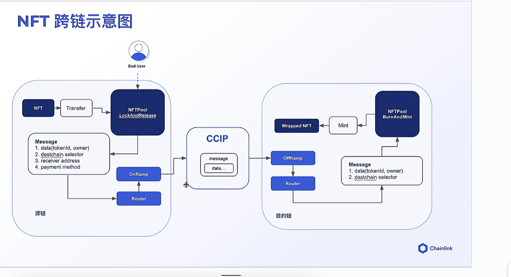

#### import "hardhat/consol.sol";
需要使用solidity hardhat插件，安装之后重启。

#### 配置私密信息
如果在同一个linux中某个之前项目已经配置过，且当前变量名和以前一致，可以不用在此配置。但需要和以前配置文件变量相同

配置sepolia url，url可以来自alchemy：https://www.alchemy.com/
npx hardhat keystore set SEPOLIA_RPC_URL

配置私钥，可以来自metamask
npx hardhat keystore set SEPOLIA_PRIVATE_KEY
npx hardhat keystore set SEPOLIA_PRIVATE_KEY2

配置api，可以来自etherscan
npx hardhat keystore set ETHERSCAN_API_KEY


#### sepolia部署
```shell
npx hardhat run --build-profile default scripts/deploy_MyToken.ts --network sepolia
```

#### 简单脚本本地部署合约
``` shell
npx hardhat node
npx hardhat compile
npx hardhat run scripts/deploy_MyToken.ts  --network localhost
```

#### 使用hardhat-deploy部署合约脚本
``` typescript
// we import what we need from the #rocketh alias, see ../rocketh.ts
import { deployScript, artifacts, loadEnvironmentFromHardhat } from "#rocketh";

// 参考rocketh：https://github.com/wighawag/rocketh
// 使用Deployment with Dependencies
export default deployScript(
    async ({ deploy, namedAccounts, get, viem, deployments }) => {
        const { deployer } = namedAccounts;
        // 通过下面方式也可以获取地址
        // const NFTAddress = deployments["FundMe"].address
        const NFTAddress = get("MyToken").address;
        // const mockInstance = viem.getContract("MyCCIPLocalSimulator");
        const mockInstance = viem.getWritableContract("MyCCIPLocalSimulator");
        const returnData = await mockInstance.read.configuration();
        const ccipConfig = returnData as any[];

        const sourceRouter = ccipConfig[1];
        const linkToken = ccipConfig[4];

        await deploy("NFTPoolLockAndRelease", {
            account: deployer,
            artifact: artifacts.NFTPoolLockAndRelease,
            // address _router,
            // address _link,
            // address NFTAddress
            args: [sourceRouter, linkToken, NFTAddress],
        });
    },
    // finally you can pass tags and dependencies
    // - **Dependencies**: Tags that a deploy script depends on, ensuring those scripts are executed first.
    // 下面dependencies中是tags，它代表本次部署，下面tags对应合约必须部署。如果没有部署，会进行部署。
    { tags: ["all", "nftpoollr"], dependencies: ['mytoken', "mycciplocalsimulator"] }
);
```

#### hardhat-deploy 部署合约
##### 启动本地网络部署，更加直观
```shell
1、npx hardhat node
2、npx hardhat compile
3、npx hardhat deploy --tags xxx --network localhost
tags不指定，将部署所有
4、验证部署的所有合约：pnpm rocketh-verify -e sepolia etherscan
```

##### 直接本地部署
```shell
npx hardhat compile
npx hardhat deploy --tags xxx 
tags不指定，将部署所有
```

#### Running Tests

To run all the tests in the project, execute the following command:

```shell
npx hardhat test
```

#### 在测试网上部署
##### 部署所有合约
``` shell
npx hardhat deploy --build-profile default --network sepolia
npx hardhat deploy --build-profile default --network amoy
验证部署在sepolia的所有合约：pnpm rocketh-verify -e sepolia etherscan
```
##### 部署tags对应合约
``` shell
npx hardhat deploy --tags xxx --build-profile default --network sepolia
npx hardhat deploy --tags xxx --build-profile default --network amoy
验证部署在sepolia的所有合约：pnpm rocketh-verify -e sepolia etherscan
```

如果某些脚本已经部署，再次执行命令将不执行部署脚本.
需要重新部署合约，需要删除deployments中想要重新部署的合约对应的文件。

#### .env 存储信息
SEPOLIA_RPC_URL

##### env使用

``` shell
npm install -D dotenv
import "dotenv/config"
// 导入env中的信息
const apiKey = process.env.ETHERSCAN_API_KEY
```

#### ccip chainLink 区块链浏览器
https://ccip.chain.link/

#### eth单位转换
参考 https://learnblockchain.cn/ethers_v5/api/utils/display-logic/

#### ganache
将ganache的地址改为127.0.0.1：8545，就可以将部署合约到ganache中了
部署命令中npx hardhat --network localhost

如果不想安装ganache，可以安装 @nomiclabs/hardhat-ganache
https://learnblockchain.cn/docs/hardhat/guides/ganache-tests.html

使用本地环境更好。