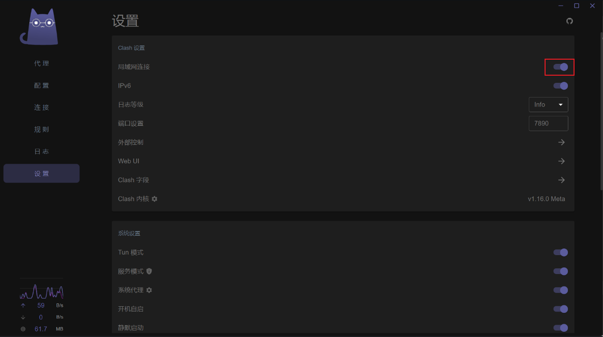
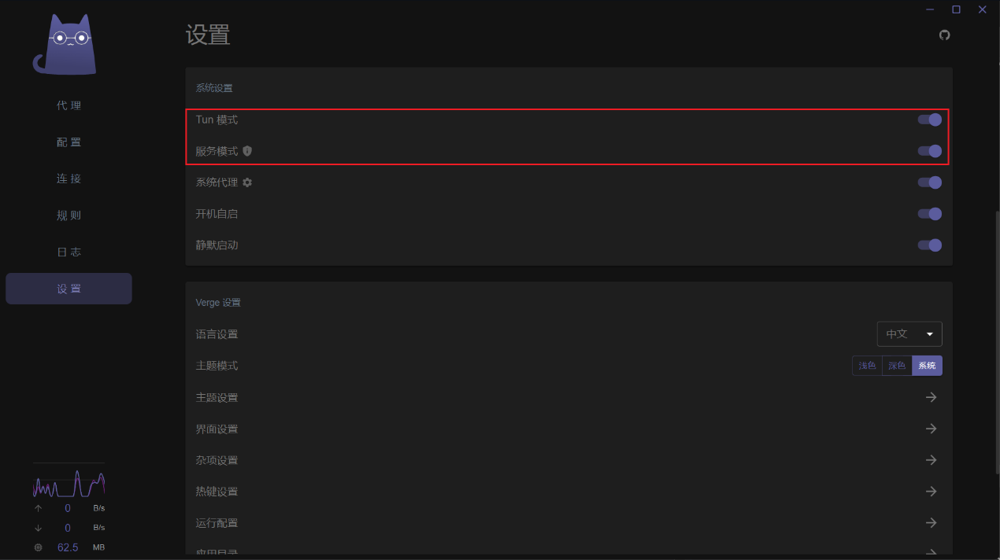

找到了该网络问题解决方法：

局域网翻墙
以翻墙软件 Clash Verge 为例（Clash for Windows 已删库），局域网翻墙的配置如下：

终端翻墙：
TUN 模式下终端也能够默认翻墙，操作方法为：先通过服务模式下载必要内容，再打开 TUN 模式。详见下图：

在 hardhat.config.js 中添加以下代码：

const { ProxyAgent, setGlobalDispatcher } = require("undici");
const proxyAgent = new ProxyAgent("http://127.0.0.1:7890");
setGlobalDispatcher(proxyAgent);
以上代码用来告诉程序按照本地代理链接网络。

记得安装 undici 依赖包：

npm install --save-dev undici
按照以上方法，可以顺利部署并测试合约。