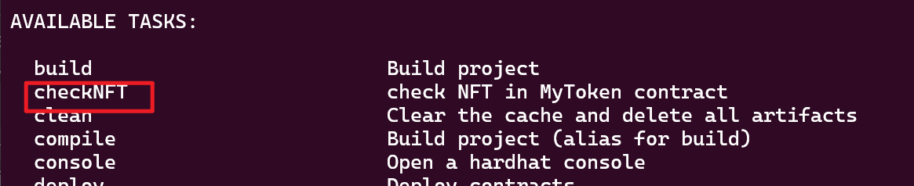

参考：https://github.com/wighawag/hardhat-deploy/blob/main/packages/hardhat-deploy/src/tasks/deploy.ts
task,是在执行npx hardhat --help,展示的可执行的命令

在本文件夹中创建task，然后再hardhat.config.ts中引入，然后在hardhat.config.ts 插件中引入。fundMeDeploy，就是这么文件导出内容的别名。
import fundMeDeploy from "./tasks/deploy-FundMe.ts"，
const config: HardhatUserConfig = {
  plugins: [xxx,fundMeDeploy],
  xxx，
  }

这个task暂时没有测试，还不可以使用。

#### 在amoy和sepolia中进行跨链测试
注：test文件中是在本地进行。task的任务就是为了在两个测试网上进行测试。
sepolia中部署，MyToken和NFTPoolLockAndRelease两个合约；
amoy中部署，WrappedMyToken和NFTPoolBurnAndMint两个合约；

注：需要在sepolia中提前部署合约
npx hardhat checkNFT --network sepolia

